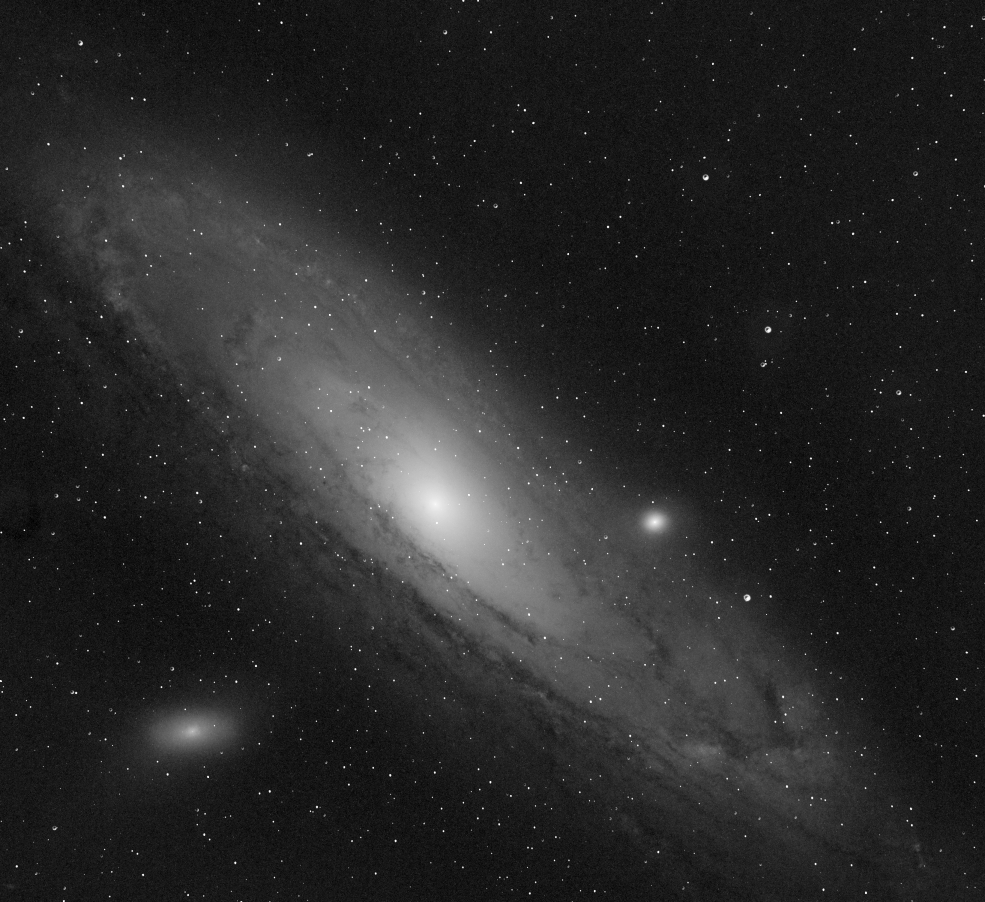
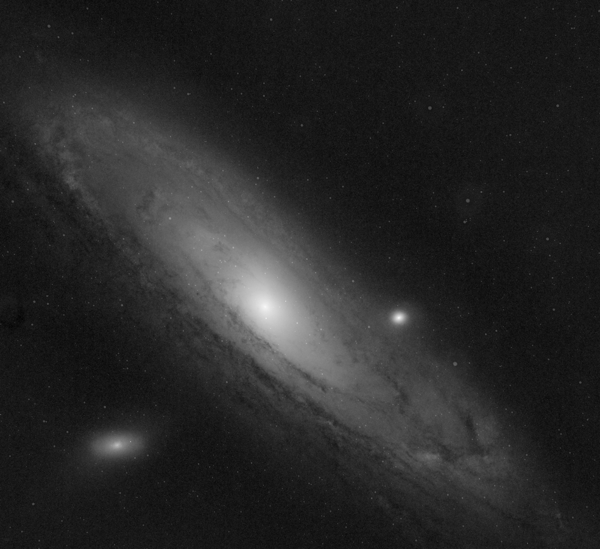
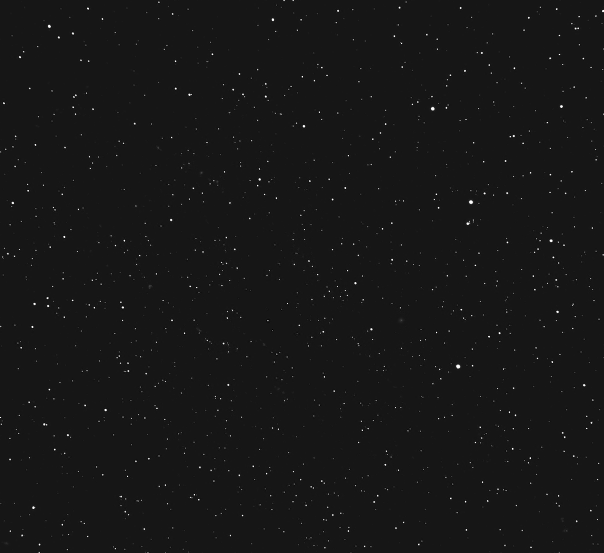

# SAE S3 — Star Reduction — État d’avancement - Problématique / Solutions rencontrées

## Auteur :

- Dhesdin Valentin
- Gobfert Frédéric
- Verstaevel Valentin

## Objectif

Réduire les étoiles sur des images **FITS** (astrophoto) sans dégrader les structures scientifiques (nébuleuse/galaxie) et sans artefacts visibles.

## Outils

Python + venv, `astropy`, `photutils` (DAOStarFinder), `opencv-python` (masques/érosion/flou), `matplotlib` (visu PNG).

---

## Jour 1 — Phase 1 terminée + début Phase 2

### Fait

- Prise en main du format **FITS** (données float + header).
- Lecture FITS et export PNG de visualisation.
- **Phase 1** : érosion globale OpenCV (kernel, itérations) + observation des résultats.
- Début **Phase 2** : mise en place de la détection d’étoiles (DAOStarFinder) et du masque binaire avec apprentissage des paramètres.

### Difficultés + solutions

- **Conflits pip / versions (numpy vs opencv)** → ajustement des versions dans `requirements.txt` (versions compatibles numpy <2.3).
- **Érosion globale = perte de détails :** méthode non sélective, elle dégrade aussi la galaxie/nébuleuse.

---

## Jour 2 — Phase 2 terminée (A + B)

### Étape A : masque d’étoiles

- Détection via `DAOStarFinder` avec :
  - bruit de fond estimé par `mad_std`
  - fond de ciel par `median`
  - paramètres ajustés (`fwhm`, `threshold`)
- Création d’un masque binaire : fond noir (0), étoiles en blanc (255) via cercles sur les centroids x et y.
- Vérification via un overlay (étoiles en rouge).

### Étape B : réduction localisée

- Calcul sur **image grise FITS float** (pas en 0..255 pour les traitements car trop de perte de qualité).
- Création `Ierode` (érosion) sur l’image float.
- Flou gaussien du masque (bords doux)
- Interpolation : Ifinal = (M × Ierode) + ((1 − M) × Ioriginal)
- Exports :
- PNG de visualisation via `matplotlib` avec imsave et pas en créeant de figure car pour du traitement d'image, il vaut mieux garder le PNG pixel pour pixel.

### Difficultés + solutions

- **Compréhension/tuning `fwhm` et `threshold`** → tests : baisse de `fwhm` + ajustement `threshold` pour mieux détecter les étoiles utiles.
- **Différence entre uint8 et float en rendu final** : la différence est surtout importante pour préserver la précision scientifique : Travailler au maximum en float32

---

### **Jour 3 - Communication**

Réunion discord afin de faire le point sur les avancées et quelles directions prendre.

- 1 au matin
- 1 début d'après-midi
- 1 au soir (uniquement textuel)

### **Jour 3/4 - Phase 3 (Détection ML - Dhesdin Valentin)**

#### Objectif de la phase 3

Remplacer la détection DAOStarFinder par une séparation **ML** (StarNet) qui fournit directement :

- `starless` : fond du ciel + nébuleuse sans étoiles
- `staronly` : couche étoiles isolée

Puis réduire uniquement la couche étoiles et recombiner les deux.

#### Choix de la méthode ML

- **StarNet (pré-entraîné)** : solution la plus judicieuse ici, car elle fournit directement une séparation **starless / stars** "fiable (si seulement...)" et rapide à intégrer dans le temps imparti.
- **Pré-labelling à partir de DAOStarFinder** : possible, mais le modèle apprendrait à partir de DAO, donc même erreurs -> Aucun intérêt car au mieux on aurait reproduit DAO et au pire : moins bien par rapport à la phase 2
- **Entraîner un ML complet** : Impossible dans ce délai, car il faut construire un dataset traiter les datas, construire les features, labellisé, gérer l’entraînement/validation, faisable mais pas à mon niveau dans le délai imparti.

#### Fait

- Récupération des 2 images générées par StarNet :
  - `starless_*.fit`
  - `starmask_*.fit`
  - Création d’un masque à partir de `staronly`
  - normalisation en [0..1]
  - Adoucissement du masque :
  - **dilatation** + **flou gaussien**
  - Réduction de la couche étoiles
  - Recombinaison

#### Problèmes rencontrés + solutions

- **Comparaison visuelle trompeuse !!!!!(fond plus noir / plus gris)**
- **Solution :** comparer en FITS dans Siril avec le même mode d’affichage et les mêmes zones.
- **Interprétation compliquée des fichiers afin de déterminer quel rendu est le meilleur en png**
- **Solution :** Phase 2 / 3 : générer fichier fit à la fin.
- Ouverture de l'une dans Siril, récuperer le même étirement (MTF) et appliqué sur la deuxième image.
- Sélection de même zones : Endroit (pixel) exact et grossissement exact entre les deux.

#### Différence Phase 2 vs Phase 3

- **Phase 2 :** on fabrique un masque avec DAOStarFinder puis on choisit automatiquement entre original et érodé via interpolation.
- **Phase 3 :** le ML donne déjà `starless` + `staronly`, on réduit uniquement `staronly`, puis on recombine avec `starless`.

#### Interprétation des résultats

| Méthode                                     | Mesure # | FWHM (px) | Ratio (rondeur) | Rendu                                |
| ------------------------------------------- | -------: | --------: | --------------: | ------------------------------------ |
| **Phase 3 (ML / StarNet)**                  |        1 |      3.39 |            1.00 | Moins étirée, + arrondi              |
| **Phase 3 (ML / StarNet)**                  |        2 |      2.47 |            1.37 | Moins étirée, + arrondi              |
| **Phase 2 (DAOStarFinder + interpolation)** |        1 |      5.10 |            1.42 | Plus large et plus étirée(très peu)  |
| **Phase 2 (DAOStarFinder + interpolation)** |        2 |      2.53 |            1.67 | Taille proche mais plus étirée (peu) |

**Conclusion :** globalement, la phase 3 (ML) donne des étoiles **légèrement moins étirées** et **légèrement plus ronde** que la phase 2 .

**WARNING** Pour avoir les deux images comparé, il faut executer le fichier python d'origine phase 2 : **"main_p2_origin.py"** et le fichier phase 3 (StarNet) : **"main_p3_starnet.py"**

<table>
  <tr>
    <th>Phase 2 (DAOStarFinder)</th>
    <th>Phase 3 (StarNet / ML)</th>
  </tr>
  <tr>
    <td width="50%">
    
    </td>
    <td width="50%">
   
    </td>
  </tr>
</table>

**Conclusion bis:** la phase 3 (ML) rend beaucoup plus noir(sombre) le fond du ciel, ce qui n'est pour moi pas une bonne chose du tout, Starnet touche à ça.
J'ai tenté de le réduire via la réduction d'étoiles par un facteur [0,1] mais cela n'est pas parfait.

### **Jour 5 - Phase 3 (Comparateur avant/Après - Dhesdin Valentin)**

#### Objectif de la phase 3

Comparateur Avant/Après : Créez un outil de visualisation qui permet de superposer
rapidement l’image originale et l’image traitée (fonction "clignotement" ou soustraction) pour
détecter les pertes de détails dans la nébuleuse.

#### Choix de la méthode

**Création de 4 fonctions** :

- compare_before_after -> Construit les images avant et après
- compare_diff -> Compare (soustraction) la différence des deux images
- save_diff_img -> récupère la différence des images, normalise les 3 et les enregistre en png
- blink_image -> Gère un switch d'image entre avant et après via matplotlib

#### Problèmes rencontrés + solutions

- **Manque de connaissances si bibliothèque existant pour faire plus simple**
- **Solution :** Gérer (manuellement) un switch de png dans une figure créer. (peut-être un peu lourd comme méthode)

#### Différence Phase 2 vs Phase 3

- **Phase 2 :** Pas d'outil de visualisationo
- **Phase 3 :** Rajout de celui-ci via plt (matplotlib)

#### Interprétation des résultats

<table>
  <tr>
    <th>Phase 3 (Before)</th>
    <th>Phase 3 (After)</th>
    <th>Phase 3 (Difference between )</th>
  </tr>
  <tr>
    <td width="33%">
    
    </td>
    <td width="33%">
   
    </td>
    <td width="33%">
   
    </td>
  </tr>
</table>

**Conclusion :** L'outil de comparaison avant après permet de voir la différence en .png.
C'est pour cela que lors de l'éxecution je créer une figure qui permet d'itérer entre les deux images, ou on voit nettement mieux la différence.

### **Jour 3/4 - Phase 3 (Interface Utilisateur - Gobfert Frederic)**

#### Objectif de la phase 3

#### Choix de la méthode ML

#### Fait

#### Problèmes rencontrés + solutions

#### Différence Phase 2 vs Phase 3

#### Interprétation des résultats

### **Jour 3 — Phase 3 : Astrométrie via API (Valentin Verstaevel)**

#### Fait

Documentation et recherche : Étude du fonctionnement de l'API Astrometry.net et de la librairie astroquery pour l'envoi et la récupération de données distantes.

Intégration API : Envoi de l'image pour un "Plate-solving" (reconnaissance du champ d'étoiles via base de données mondiale).

Récupération du catalogue : Extraction du fichier corr.fits contenant les positions exactes ($X, Y$) des étoiles confirmées par l'API.

#### Difficultés + solutions

Fichier temporaire indispensable : L'API nécessite un fichier physique avec son Header pour fonctionner. Solution : Création d'un temp_for_api.fits incluant les données et l'entête d'origine, supprimé automatiquement après l'envoi.

Bug de réception astroquery : L'envoi fonctionnait mais la récupération des résultats (jobs / données) échouait malgré un envoi réussi. Solution : Contournement via des requêtes HTTP directes (ast.\_request) sur l'URL du Job ID pour forcer le téléchargement du catalogue.

Erreur "No SIMPLE card" : Problème de lecture du fichier retourné par le serveur. Solution : Lecture forcée via Table(hdul[1].data) pour extraire proprement les colonnes field_x et field_y.

Suite à un échec de push causé par des conflits de versions sur astroquery et des fichiers de configuration corrompus, j'ai dû supprimer et reconstruire l'environnement virtuel (.venv). Cette purge a permis de réinstaller proprement les dépendances via pip et de débloquer la synchronisation avec la branche API.

```bash
python -m venv .venv
source .venv/bin/activate
pip install -r requirements.txt
```

## Examples files

Example files are located in the `examples/` directory. You can run the scripts with these files to see how they work.

- Example 1 : `examples/HorseHead.fits` (Black and whiteFITS image file for testing)
- Example 2 : `examples/test_M31_linear.fits` (Color FITS image file for testing)
- Example 3 : `examples/test_M31_raw.fits` (Color FITS image file for testing)

## Preview :

- Dossier results/original
  - starless (Image original uniquement sans étoiles fourni par starnet)
  - staronly (Image original uniquement étoiles fourni par starnet)
- Dossier results/mask
  - mask_stars_thresh (MAsque binaire avec pixel sur étoiles)
  - mask_stars_dilate (Masque binaire avec agrandissement des pixels détection étoiles)
  - star_blurred (Masque avec le flou appliqué)
  - star_reduced (Masque avec réduction appliqué)
- Dossier resultsAPI
  - cf même dossiers que phase2
- Dossier results/compare
  - before_reduced (Avant réduction)
  - after_reduced (Après réduction)
  - diff_abs_between (différence entre les deux images)
- Dossier results/final_image
  - final_combined_phase3.fits (Image exportée en .FITS pour SIRIL)
  - final_combined_phase3.png (Image save pour preview en PNG)
